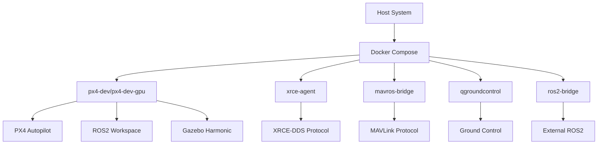

# PX4 ROS2 Jazzy Docker Environment

A comprehensive, cross-platform Docker environment for PX4 ROS2 development with Gazebo Harmonic simulation. This setup automatically detects your system configuration and provides optimal performance across **Ubuntu**, **WSL2**, and different **CUDA** scenarios.

## 🚀 Features

- **Cross-Platform Compatibility**: Seamless operation on Ubuntu, WSL2, and other Linux distributions
- **GPU Acceleration**: Automatic NVIDIA GPU detection and configuration
- **Permission Management**: Robust user/group handling preventing permission issues
- **Multiple Communication Bridges**: Support for both XRCE-DDS and MAVROS
- **Comprehensive Services**: Includes QGroundControl, XRCE-DDS Agent, MAVROS bridge, and ROS2 bridge
- **Environment Detection**: Automatic OS and GPU detection with appropriate configuration
- **Error Handling**: Comprehensive error checking and recovery mechanisms

## 📋 Prerequisites

### Ubuntu/Linux
```bash
# Install Docker
curl -fsSL https://get.docker.com -o get-docker.sh
sudo sh get-docker.sh

# Install Docker Compose
sudo apt-get update
sudo apt-get install docker-compose-plugin

# Add user to docker group
sudo usermod -aG docker $USER
newgrp docker
```

### WSL2
```bash
# Install Docker Desktop for Windows with WSL2 backend
# Or install Docker directly in WSL2:
curl -fsSL https://get.docker.com -o get-docker.sh
sudo sh get-docker.sh

# For GPU support in WSL2, install NVIDIA Container Toolkit
distribution=$(. /etc/os-release;echo $ID$VERSION_ID)
curl -s -L https://nvidia.github.io/nvidia-docker/gpgkey | sudo apt-key add -
curl -s -L https://nvidia.github.io/nvidia-docker/$distribution/nvidia-docker.list | sudo tee /etc/apt/sources.list.d/nvidia-docker.list

sudo apt-get update && sudo apt-get install -y nvidia-container-toolkit
sudo systemctl restart docker
```

## 🏃‍♂️ Quick Start

### Using Docker Compose (Recommended)
```bash
# Start the development environment (auto-detects GPU)
./docker-compose-run.sh up

# Start with specific profiles
./docker-compose-run.sh up --profile gpu --with-qgc

# Open shell in container
./docker-compose-run.sh shell

# Show logs
./docker-compose-run.sh logs

# Stop services
./docker-compose-run.sh down
```

### Using Docker Run Script
```bash
# Start container (auto-detects environment)
./docker_run.sh

# Start with custom name
./docker_run.sh my_px4_container
```

## 🔧 Available Profiles

| Profile | Description | Use Case |
|---------|-------------|----------|
| `default` | CPU-only main environment | Basic development |
| `gpu` | GPU-accelerated environment | High-performance simulation |
| `xrce-agent` | XRCE-DDS Agent service | PX4 native communication |
| `mavros` | MAVROS bridge service | Classic MAVLink communication |
| `qgc` | QGroundControl | Ground control station |
| `bridge` | ROS2-Gazebo bridge | External ROS2 communication |

## 🎯 Usage Examples

### Basic Development
```bash
# Start basic environment
./docker-compose-run.sh up

# Access container
./docker-compose-run.sh shell

# Run install script
cd /home/user/shared_volume/ros2_ws/src/uav_gz_sim && ./install.sh
```

### GPU-Accelerated Development
```bash
# Start with GPU support
./docker-compose-run.sh up --profile gpu

# Start with GPU + QGroundControl
./docker-compose-run.sh up --profile gpu --with-qgc
```

### Multi-Service Setup
```bash
# Start with all services
./docker-compose-run.sh up --with-qgc --with-xrce --with-mavros --with-bridge

# Start specific combination
./docker-compose-run.sh up --profile gpu --with-mavros --with-qgc
```

## 🌍 Environment Detection

The setup automatically detects and configures:

### Operating System
- **Ubuntu/Linux**: Native X11 forwarding, direct GPU access
- **WSL2**: WSLg integration, Windows GPU passthrough
- **Other Linux**: Generic Linux configuration

### GPU Support
- **NVIDIA GPU**: Automatic CUDA acceleration setup
- **Generic GPU**: DRI device access for hardware acceleration  
- **CPU-only**: Fallback to software rendering

### Permission Handling
- **User/Group Mapping**: Automatic UID/GID matching
- **Device Access**: Proper permissions for GPU, USB, serial devices
- **WSL2 Compatibility**: Special handling for WSL2 permission model

## 🔧 Configuration

### Environment Variables
```bash
# User credentials (optional)
export GIT_USER="your-username"
export GIT_TOKEN="your-token"

# Custom workspace location
export WORKSPACE_DIR="/path/to/your/workspace"

# Force CPU mode
export FORCE_CPU=true
```

### Volume Mounts
- **Workspace**: `~/px4_ros2_jazzy_shared_volume` ↔ `/home/user/shared_volume`
- **Display**: Automatic X11/Wayland forwarding
- **Devices**: USB, serial, GPU devices as available

## 🐛 Troubleshooting

### Permission Issues
```bash
# Check container user
./docker-compose-run.sh shell
id

# Fix workspace permissions
sudo chown -R $USER:$USER ~/px4_ros2_jazzy_shared_volume
```

### GPU Issues
```bash
# Check GPU detection
nvidia-smi

# Check Docker GPU support
docker run --rm --gpus all nvidia/cuda:11.0-base nvidia-smi

# Force CPU mode
./docker-compose-run.sh up --no-gpu
```

### Display Issues
```bash
# Linux: Check X11 forwarding
echo $DISPLAY
xhost +local:docker

# WSL2: Check WSLg
echo $WAYLAND_DISPLAY
ls /mnt/wslg
```

### Service Issues
```bash
# Check service status
./docker-compose-run.sh status

# View specific service logs
docker-compose logs px4-dev

# Restart specific service
docker-compose restart px4-dev
```

## 📊 Service Architecture



## 🔍 Advanced Usage

### Custom Profiles
```bash
# Create custom profile combinations
./docker-compose-run.sh up --profile gpu --profile mavros --profile qgc
```

### Development Workflow
```bash
# 1. Start development environment
./docker-compose-run.sh up --profile gpu

# 2. Open shell
./docker-compose-run.sh shell

# 3. Run installation
cd /home/user/shared_volume/ros2_ws/src/uav_gz_sim
./install.sh

# 4. Build workspace
cd /home/user/shared_volume/ros2_ws
colcon build

# 5. Run simulation
source install/setup.bash
ros2 launch px4_msgs px4.launch.py
```

### Multi-Container Development
```bash
# Terminal 1: Main development
./docker-compose-run.sh shell

# Terminal 2: MAVROS bridge
docker-compose exec mavros-bridge bash

# Terminal 3: QGroundControl
docker-compose exec qgroundcontrol bash
```

## 🧹 Maintenance

### Cleanup
```bash
# Remove all containers and volumes
./docker-compose-run.sh clean

# Remove specific containers
docker-compose down
docker system prune -f
```

### Updates
```bash
# Rebuild images
./docker-compose-run.sh build

# Update base images
docker-compose pull
```

## 📝 Notes

- The workspace directory is automatically created and mapped to the container
- All services use the same shared volume for consistency
- GPU support is automatically detected and configured
- Permission issues are handled automatically through the entrypoint script
- The setup works identically across Ubuntu, WSL2, and other Linux distributions

## 🤝 Contributing

1. Fork the repository
2. Create your feature branch
3. Test across different environments (Ubuntu, WSL2, GPU/CPU)
4. Submit a pull request

## 📄 License

This project is licensed under the MIT License - see the LICENSE file for details.

---

**Ready to fly! 🚁** Your PX4 ROS2 development environment is now configured for optimal performance across all platforms.